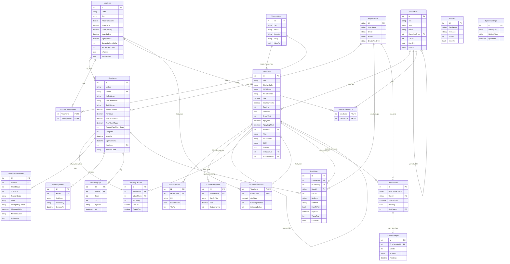

# ShopMVC ERD

ERD ben duoi duoc rut ra tu `AppDbContext` va cac model hien tai.

- Mo file nay trong VS Code/GitHub neu renderer cua ban ho tro Mermaid.
- Neu can export anh, copy block `mermaid` vao `https://mermaid.live`.
- So do tap trung vao bang nghiep vu chinh. Cac bang Identity chi gom `AspNetUsers` de de nhin.

## Nhom bang chinh

- Danh muc / thuong hieu / san pham: `DanhMucs`, `ThuongHieus`, `SanPhams`, `AnhSanPhams`, `ChiTietSanPhams`
- Ban hang: `DonHangs`, `DonHangChiTiets`, `OrderStatusHistories`, `DonHangNotes`, `DonHangLogs`
- Khuyen mai: `Vouchers`, `VoucherThuongHieus`, `VoucherDanhMucs`, `VoucherSanPhams`
- Trai nghiem nguoi dung: `DanhGias`, `ChatSessions`, `ChatMessages`, `Banners`
- Cau hinh he thong: `SystemSettings`

## Neu muon chup anh dep nhanh

1. Mo file nay trong Markdown preview neu editor render Mermaid.
2. Hoac copy sang `https://mermaid.live`.
3. Chon `Actions` -> `Download PNG` / `Download SVG`.
